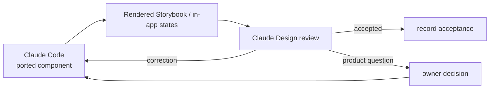

# 05 — Fidelity round-trip

The design handoff was not complete when Code compiled successfully.

The working component had to return to Design **inside the real application context**.

## Review medium

For Email Reading Surface v2, Storybook screenshots were the review medium.

Code returned:

- rendered state screenshots;
- ported components with stable test IDs;
- the divergence list;
- contract questions discovered during implementation.

Design reviewed the rendered behavior rather than source code.

## The round-trip

Small rounds were expected.

The original Email instructions described two rounds as typical.

The later formal process requires at least two rounds for a design-first surface.

## What Design reviewed

The broader method checks things such as:

- hierarchy and composition;
- content density and wrapping;
- state visibility;
- responsive behavior;
- loading/empty/partial/stale/error treatment;
- mutation success/failure states;
- return behavior;
- mobile/desktop parity;
- whether technical integration caused interaction drift.

## The reviewer can be wrong

The Email v2 fidelity response is useful because Design did not simply issue corrections to Code.

Design also accepted corrections **from Code**.

Examples included:

- an API capability Design thought was absent but Code found in the repository;
- an action payload assumption that did not match the real adapters;
- real review-status vocabulary that required updating the Design adapter.

This made fidelity review a reconciliation process, not a one-way art-direction step.

## Final acceptance

The merged Email v2 PR records:

- two Design ↔ Code fidelity rounds;
- rendered Storybook evidence;
- owner decisions for unresolved contract questions;
- a divergence record;
- final cutover into the application.

## Why this matters

A port can be technically correct and still be a different product.

The fidelity loop treats **interaction intent** as something that must survive contact with the real codebase.
