# Planning Coach — Design-to-code loop

Planning Coach used a deliberate cross-model workflow to keep **product architecture, interaction design, implementation truth, and verification** from collapsing into one AI conversation.

The process combined:

- the product owner;
- GPT for product interaction / architecture reasoning;
- Claude Design for interaction contracts, state-rich prototypes, and port-ready components;
- Claude Code for repository/API truth, implementation, wiring, tests, and in-app Storybook evidence.

Email Reading Surface v2 is the concrete worked example in this package because the private repository later identifies that port as the implementation that **proved the design-first delivery method**.

The Email surface itself continued to evolve afterward. This package uses v2 as **process evidence**, not as a claim that every v2 interaction remains the current product surface.

## The loop

```mermaid
flowchart LR
    A["Owner + GPT<br/>product interaction & architecture"] --> B["Claude Design<br/>interaction contract"]
    B --> C["Owner / Design iteration<br/>stateful wireframes"]
    C --> D["Claude Code<br/>API + repository evidence"]
    D --> E["Claude Design<br/>gap analysis"]
    E --> F["Claude Design<br/>port-ready component"]
    F --> G["Claude Code<br/>port + real wiring"]
    G --> H["Storybook / in-app evidence"]
    H --> I["Claude Design<br/>fidelity review"]
    I -->|"corrections"| G
    I -->|"accepted"| J["Independent review + cutover"]
```

## Artifacts

| Artifact | What it demonstrates |
|---|---|
| **[Actual sanitized Email v2 handoff bundle](example-handoff/README.md)** | Executable Design prototypes, real adapter JS, implementation instructions, gap analysis, owner decisions, and the returned fidelity response |
| [01 — Product interaction before UI](01-product-interaction-before-ui.md) | Product meaning, ownership, and system fit are decided before implementation |
| [02 — API evidence and gap analysis](02-api-evidence-and-gap-analysis.md) | Code reports what actually exists; Design reports what the intended interaction still needs |
| [03 — Port-ready component](03-port-ready-component.md) | Design produces something intended to be wired, not reinterpreted from screenshots |
| [04 — Port and wire](04-port-and-wire.md) | Code integrates the accepted design without independently redesigning it |
| [05 — Fidelity round-trip](05-fidelity-roundtrip.md) | Rendered in-app evidence goes back to Design; divergences are explicit and resolved |
| [06 — Method evolution](06-method-evolution.md) | The delivery process itself improved when an earlier convention created the wrong incentives |

## Worked example: Email Reading Surface v2

**[Open the sanitized executable handoff bundle →](example-handoff/README.md)**

The private repository records the Email Reading Surface v2 replacement port as a completed Design ↔ Code loop:

- Claude Design supplied the component package and behavioral reference;
- Claude Code wired it into the real application;
- Storybook screenshots were the review medium;
- divergences and contract questions were returned to Design;
- Design accepted corrections and updated its own gap analysis;
- two fidelity rounds were completed;
- the old frontend was replaced in one cutover;
- the merged implementation included the tests and contract updates needed to support the final surface.

The repository subsequently generalized this into the standing design-first process for future student-facing surfaces.

## Evidence boundary

The private repository strongly records the **Claude Design ↔ Claude Code** half of the loop.

The earlier **Owner + GPT** product-interaction / architecture work was part of the actual working process used to decide feature ownership and cross-product fit. It is described here from the owner's process rather than represented as a repository artifact for every feature.

## Why the process existed

AI tools make it easy to move quickly before anyone notices that:

- Design invented an endpoint that does not exist;
- Code implemented a convenient behavior the product never authorized;
- a prototype covers only the happy path;
- a port is visually similar but semantically different;
- a gap is hidden behind a control that looks operational;
- a local feature choice violates a system-wide interaction rule.

The loop creates explicit handoffs where those failures become visible.

## Private-source evidence

A technical review can show the original Email v2 design package, adapter, gap analysis, divergence log, fidelity response, Storybook evidence, merged PR #293, and the later execution plan that formalized the method.
