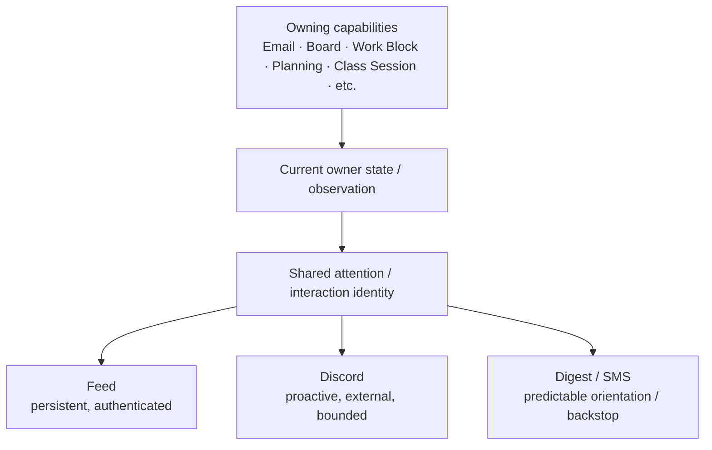

# 02 — Interaction model

## One matter, several expressions

The product already had more than one place where a student could encounter a planning matter.

The design goal was to avoid creating separate attention systems that could disagree about whether something was current, handled, or actionable.

The underlying matter stays owned by its domain.

A Discord message can present or invoke an authorized action; it does not become a second owner of Email, Board, Planning, or Work Block truth.

## Different surfaces have different jobs

### Feed

- persistent;
- authenticated;
- can support richer browsing/composition;
- good for a continuing attention inventory.

### Discord

- proactive;
- externally delivered;
- deliberately dense in only a few items;
- optimized for quick comprehension and bounded action.

### SMS / digest

- predictable orientation/backstop;
- even more constrained;
- useful when interaction depth is low.

## Smallest faithful interaction

A key design question was:

> What is the smallest amount of context that still lets the student act correctly?

That is different from "send as little as possible."

Too much detail creates privacy and attention risk.

Too little detail creates a useless pointer that forces the student to open another application for every routine decision.

The product therefore aimed for an **action-complete projection** where permitted, with escalation to the richer owner surface when the channel could not faithfully host the interaction.

## Structured before free-form

The rollout model separated four steps:

1. system initiates a bounded message;
2. student responds through structured components;
3. later, student can initiate through structured commands;
4. free-form natural-language initiation is a later/exceptional capability.

This kept the first release inside a smaller intent and authority surface.

## Density as product behavior

The design used a small cap on proactive items and choices.

The intent was not to maximize message throughput.

It was to preserve a two-second scan:

- a small number of matters;
- enough context to understand them;
- a small, truthful action set;
- no disabled controls pretending capability exists.

## Status note

The early Attention & Interaction and Discord Interaction contracts were draft design artifacts. They are useful evidence of the interaction-design process, but later ratified rules and implementation decisions supersede them where they disagree.

That distinction matters because one of the most important later decisions was to change Discord's place in the architecture entirely.
