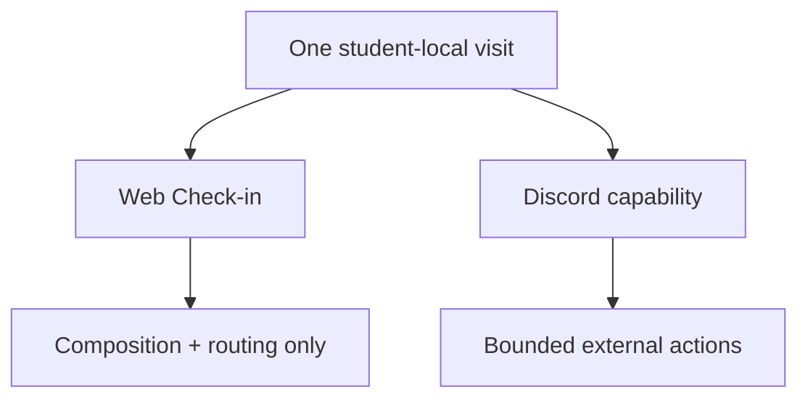

# 03 — Why Discord became its own capability

## Original model

The first architecture treated Discord as another expression of Check-in:

```text
Check-in
  ├─ web expression
  └─ Discord expression
```

That looked attractive because the two experiences shared orientation content and could refer to the same morning/evening visit.

## The contradiction

Check-in had a defining architectural identity:

> **compose current owner state and route the student to the real action owner; do not create a second action path.**

Discord's value depended on something different.

The external channel could not host all of the full authenticated owner surfaces, yet it needed to support some bounded actions in place.

Trying to keep Discord inside Check-in required widening multiple Check-in rules solely for Discord.

That was the signal that the placement was wrong.

## The decision

Instead of weakening Check-in, the architecture changed:



The two capabilities share visit state.

They do **not** share ownership semantics.

## Consequences

### Check-in stayed clean

Its web expression remained composition-only and desktop-scoped.

Discord-specific exceptions did not leak into its rules.

### Discord got its own consent and trust boundary

Discord could now own:

- external link state;
- bounded external presentation;
- external interaction handling;
- channel-specific disclosure rules;
- its own action-security constraints.

It still did not own Email, Board, Planning, or Work Block truth.

### Delivery did not open a visit

The architecture preserved an important distinction:

**delivering content is not the same thing as the student entering/engaging with the capability.**

The visit begins on the student's act, not when a scheduler pushes a message.

## Why I kept the wrong turn

This is one of the clearest examples in Planning Coach of architecture being corrected by product semantics rather than by implementation convenience.

The tempting response would have been:

> "Discord is almost Check-in, so add a few exceptions."

The better question was:

> "If the exceptions all belong to Discord, is Discord actually the same capability?"

The answer was no.

## Implementation evidence

The private implementation PR that records this decision deliberately restores the widened Check-in rules to their prior form and introduces Discord as a separate capability.

It also records the decision as product/governance authority rather than silently changing the code.

## Private-source evidence

- merged Planning Coach PR #654 — *Discord as its own capability*
- Check-in interaction/governance rules
- `DISCORD-001`
