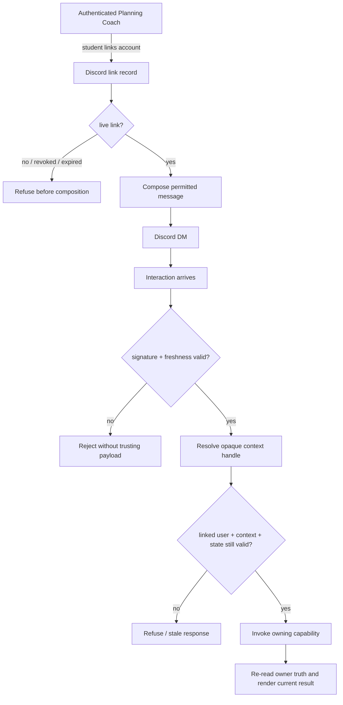

# 04 — Trust boundary

Discord was designed as an external action surface, not as generalized Planning Coach authentication.

## Trust flow

## Design decisions

### 1. Linking is consent; configuration is not

The presence of a bot token or an enabled feature flag does not mean the student consented to external delivery.

The student's link act creates the authorization record.

Unlinking withdraws it.

A missing or non-live link fails closed.

### 2. Refuse before composing content

The outbound gate takes a **composition callable**, not a fully assembled message.

That is load-bearing.

If no authorized recipient exists, the system does not merely avoid the HTTP send. It avoids assembling the content at all.

This prevents a later log/error/debug path from accidentally receiving a message that should never have existed for that destination.

### 3. Stable external identity

The link stores the stable Discord user ID, not a username/display name.

The link lifecycle is retained so the system can answer what was authorized and when.

### 4. Opaque action handles

Component identifiers do not contain:

- student IDs;
- email IDs;
- course IDs;
- plan/work-block IDs;
- observation IDs;
- sensitive text;
- action semantics that can be inverted into authority.

The external component gets an opaque, expiring server-side handle bound to the expected user and context.

### 5. Signed ingress first

Inbound Discord interactions are verified against Discord's signature and timestamp before the body is trusted.

A bad signature is rejected before parsing becomes meaningful.

The endpoint also checks freshness to reduce replay risk.

### 6. Re-read current owner state before writing

A message is a snapshot.

An action is not allowed to blindly write against that snapshot.

The handler re-checks current owner state, rejects stale preconditions, and uses idempotent write semantics.

### 7. Structural logs

The operational path is designed around structural logging:

- interaction/attempt identifiers;
- closed outcome categories;
- timing/latency;
- counts.

It avoids logging message bodies, source prose, student text, usernames, or raw component payload content.

## Separate operator mirror consent

During the supervised build, an optional operator mirror could receive the same messages.

That was modeled as a separate consent with mandatory expiry rather than being implied by the student's own Discord link.

The distinction mattered: two recipients represent two disclosure decisions.

## Implementation evidence

Merged private-repo work includes:

- durable Discord link records;
- read-time liveness checks;
- consent-gated composition;
- outbound fan-out outcomes;
- signed Discord interaction ingress;
- freshness checks and fail-closed guards;
- structural-only logging rules.

## Limits

The trust architecture is not a claim that every content category is appropriate for Discord.

Disclosure policy remains a separate decision.

The architecture answers **who may receive and invoke an action, and how that invocation is bounded**.
