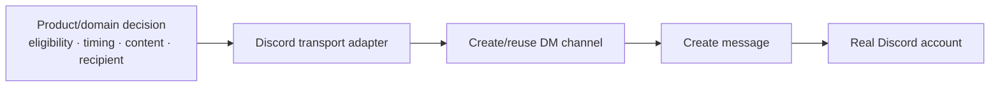

# 05 — First implementation slice

## Why start with transport?

Before building the full product experience, I wanted to prove the narrow external mechanism independently:

> Can Planning Coach send a real synthetic Discord DM through a reusable adapter without letting the transport layer decide product semantics?

That led to an implementation handoff with a deliberately small responsibility.

## Boundary



The transport adapter could:

- address the Discord API;
- create/reuse the DM channel;
- send a complete payload;
- translate transport success/failure.

It could **not** decide:

- whether the student was eligible;
- whether the student consented;
- when a message should be delivered;
- what facts should be included;
- which domain action an interaction represented.

Those decisions belonged above the adapter.

## Required proof

The handoff required a real synthetic send rather than configuration-only evidence.

That separated:

- **transport proof** — token/API path works;
- **product delivery proof** — an authorized recipient exists and content is allowed;
- **interaction proof** — inbound actions can be verified and executed safely.

Treating those as separate slices made failures easier to localize.

## Composition was also split

The student-facing message was divided into two layers:

```text
structured product payload
        ↓
Discord renderer
        ↓
Discord Create Message JSON
```

The structured layer contains product meaning.

The renderer contains Discord-specific vocabulary and layout.

This avoids making every new product item require changes to unrelated delivery renderers.

## Implementation corrected the reference artifact

The first implementation deliberately refused to copy unsafe details from the reference payload.

One example: early fixture component values contained raw entity IDs.

The ratified Discord rule forbade that.

The implementation therefore omitted interactive rows until an opaque-handle issuer existed, and a regression test proved that rendering the fixture literally would fail the rule.

This is an important part of the development method:

> the reference artifact is evidence, but higher authority wins when the reference is wrong.

## From transport to signed interaction ingress

Later increments added a signed external interaction endpoint.

The request guard sequence was intentionally ordered:

1. verify Discord's signature over the raw body;
2. verify timestamp freshness;
3. only then interpret the interaction;
4. apply user/namespace/context guards;
5. acknowledge within the interaction deadline;
6. perform bounded background work where appropriate;
7. post a result through the governed delivery path.

## What this artifact proves

The implementation was not "wire Discord into the app."

It was a series of narrow seams:

- transport;
- composition;
- consent gate;
- signed ingress;
- action routing;
- operational diagnostics.

Each could be tested independently and then composed into the product.

## Private-source evidence

- Discord outbound transport implementation handoff
- merged transport implementation
- merged PR #654 (consent gate + composition)
- merged PR #676 (signed interaction endpoint)
