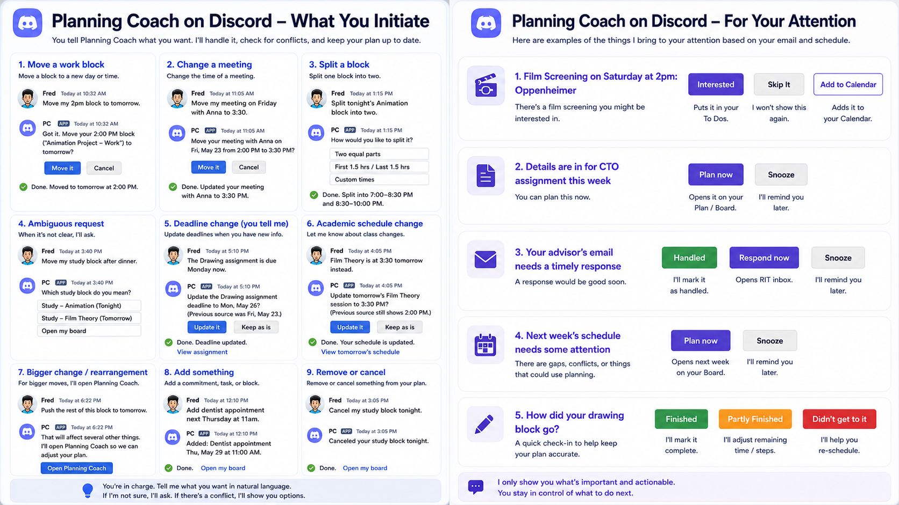

# Planning Coach — Discord design and implementation trail

Discord became a useful test of the full Planning Coach product-engineering process: a constrained external interface had to be useful enough to act in, while remaining bounded by student agency, privacy, identity, security, and the ownership rules of the larger application.

This package is a **public synthesis** of evidence from the private `planning-coach-v1` repository. It does not copy real student data, credentials, institutional identifiers, or private messages.

## Interaction concept reviewed with the pilot student

*Early interaction concept showing both student-initiated actions and proactive Planning Coach prompts in Discord.*

This concept was reviewed with the pilot student. Based on that review, the student expressed interest in **Discord as an interface for Planning Coach**. That signal helped justify continuing the channel investigation beyond a purely technical proof of concept.

The image is preserved as **design evidence**, not as a claim that every illustrated interaction shipped exactly as drawn. The implementation subsequently changed as privacy/security work, capability ownership decisions, and real-device testing clarified what Discord should own and how it should behave.

## The sequence

The useful part of the story is not that Discord was integrated. It is that each step changed the next product or engineering decision.

## Artifacts

| Artifact | What it demonstrates |
|---|---|
| [01 — Channel and risk assessment](01-channel-risk-assessment.md) | Technical feasibility, privacy/security research, and how research became product constraints |
| [02 — Interaction model](02-interaction-model.md) | Why Discord was designed as a proactive bounded interaction surface rather than a miniature web app |
| [03 — Why Discord became its own capability](03-why-discord-became-a-capability.md) | A product-architecture correction when the original placement violated Check-in's identity |
| [04 — Trust boundary](04-trust-boundary.md) | Consent, revocation, opaque action handles, signed ingress, freshness/replay protection, and structural logging |
| [05 — First implementation slice](05-first-vertical-slice.md) | Turning the product boundary into a narrow transport/compose/delivery implementation with real proof |
| [06 — Real-device test and implementation pivot](06-real-device-test-and-pivot.md) | Field testing, hypothesis elimination, isolated-variable evidence, and the later decision to adopt `discord.py` |

## Three decisions worth highlighting

### 1. Useful detail instead of blanket pointer-only delivery

The initial privacy posture was deliberately conservative while policy questions were unresolved. Research led to a more useful target: ordinary planning facts can be eligible for detailed or minimized delivery under a deterministic policy, while high-sensitivity categories remain restricted.

That is different from saying the channel is "safe" in the abstract. The product decides **what kind of fact is appropriate on what surface**.

### 2. Discord did not remain a Check-in expression

The first architecture tried to make Discord another expression of the Check-in capability. Implementation exposed a contradiction: Check-in is composition-and-routing only, while Discord needed to host bounded actions directly.

Rather than weaken Check-in's rules to make the new channel fit, Discord became a separate capability that shares the same visit state.

### 3. Real-device evidence overrode the hand-built implementation direction

The HTTP interaction endpoint worked reliably from desktop but interaction buttons were unreliable on one iPhone. A later controlled trial isolated one configuration variable: the same production application and message delivered all button presses over a gateway session when the Interactions Endpoint URL was cleared, then regressed when the URL was restored.

The resulting owner decision was to make `discord.py` the foundation of the service's Discord communication. At the time captured here, that decision is documented but the service migration is not yet shipped.

## Evidence discipline

This package deliberately distinguishes among:

- **research** — informs a decision but is not product authority;
- **draft interaction specifications** — useful evidence of the design process, but superseded where later ratified rules disagree;
- **merged implementation evidence** — behavior present in the private repository;
- **open decisions / open PRs** — direction that should not be presented as shipped.

The private repository can be shared for technical review.
